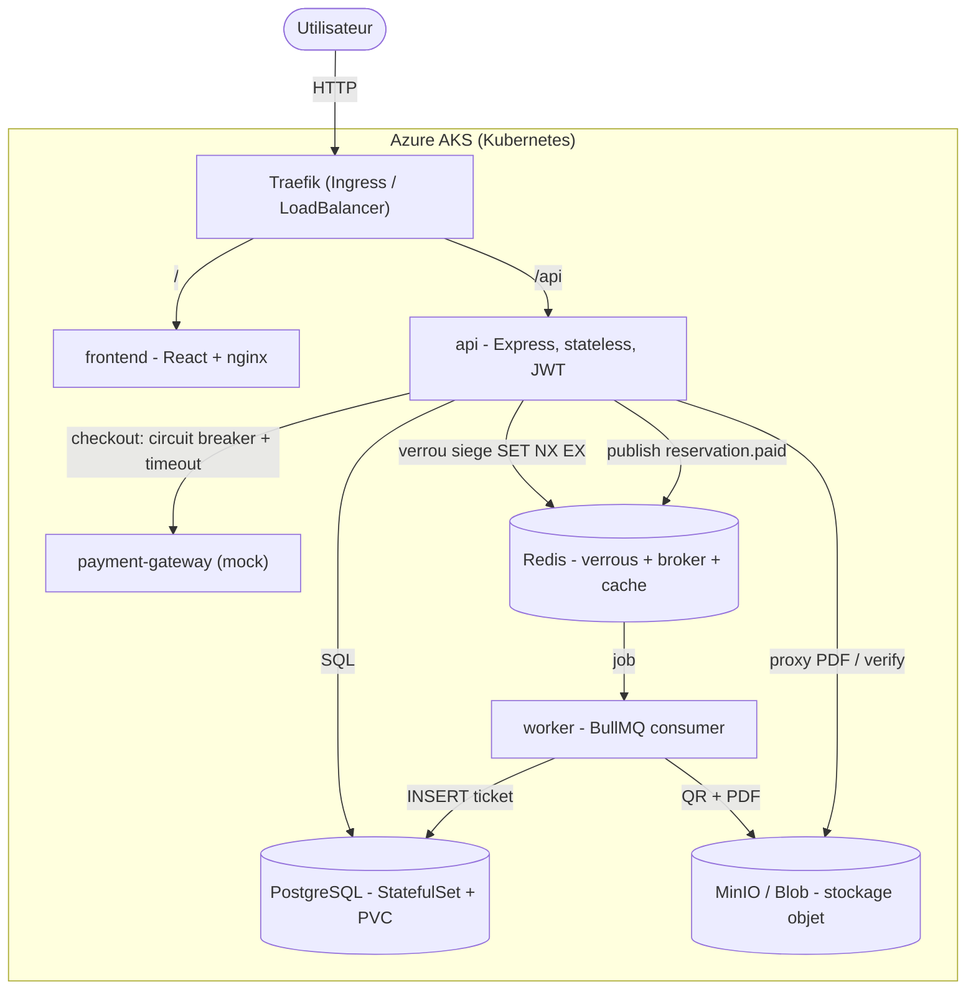

# TicketFlow

Plateforme de billetterie **cloud-native** avec réservation de sièges, paiement et génération de billets (QR + PDF). Projet M2 démontrant les patterns d'architecture distribuée : microservices, broker de messages, circuit breaker, contrôle de concurrence, stockage objet, et déploiement Kubernetes sur Azure via Terraform et CI/CD.

🌐 **Application en ligne : http://20.215.94.75**

---

## Sommaire
- [Architecture](#architecture)
- [Choix technologiques](#choix-technologiques)
- [Concepts cloud-native → où c'est implémenté](#concepts-cloud-native--où-cest-implémenté)
- [Démarrage rapide (local)](#démarrage-rapide-local)
- [Déploiement cloud & CI/CD](#déploiement-cloud--cicd)
- [Choix d'architecture assumés](#choix-darchitecture-assumés)

---

## Architecture



**Flux principal** : l'utilisateur réserve des sièges (verrou Redis temporaire) → checkout → l'API appelle le `payment-gateway` via un **circuit breaker** → en cas de succès, publie `reservation.paid` → le **worker** génère le QR + PDF et l'envoie dans le stockage objet → l'API sert le PDF et la page de vérification du QR.

---

## Choix technologiques

| Domaine | Choix | Pourquoi |
|---|---|---|
| API | **Node.js / Express** | Léger, asynchrone, écosystème mature ; idéal pour un service stateless. |
| Auth | **JWT + bcrypt** | Authentification stateless (aucune session serveur) → scalabilité horizontale. |
| Broker | **BullMQ (Redis)** | Retries, backoff et dead-letter intégrés ; pas d'infra supplémentaire (réutilise Redis). |
| Circuit breaker | **opossum** | Standard Node pour timeout + fallback autour des appels externes. |
| Concurrence | **Redis `SET NX EX`** | Verrou atomique avec TTL → empêche la double réservation d'un siège. |
| Stockage objet | **MinIO (local) / Azure Blob** | Compatible S3 ; PDF servis via l'API (stockage privé, jamais exposé). |
| Base de données | **PostgreSQL** | Modèle relationnel adapté (événements, sièges, réservations, billets). |
| Orchestration | **Kubernetes (AKS)** | Démontre StatefulSet, Ingress, probes, HA — plus complet qu'un PaaS. |
| IaC | **Terraform** | Provisioning reproductible et idempotent de l'infra Azure. |
| Ingress | **Traefik (Helm)** | Routage `/api` et `/` + LoadBalancer → URL publique. |
| CI/CD | **GitHub Actions** | Build/test + déploiement continu sur push `main`. |

---

## Concepts cloud-native → où c'est implémenté

| Concept | Fichier(s) |
|---|---|
| API stateless + JWT | `backend/api/src/auth.js` |
| Microservices | `backend/api`, `backend/worker`, `backend/payment-gateway` |
| Circuit breaker + timeout + fallback | `backend/api/src/payment.js`, `routes/reservations.js` |
| Broker de messages avec acquittement | `backend/api/src/queue.js`, `backend/worker/src/index.js` |
| Retries + dead-letter | `backend/worker` (config BullMQ `attempts`, `backoff`, `removeOnFail`) |
| Contrôle de concurrence (Redis) | `backend/api/src/holds.js` (`SET NX EX`) |
| Worker idempotent | `backend/worker/src/handlers/reservationPaid.js` + `UNIQUE(reservation_id, seat_id)` |
| StatefulSet + volume persistant | `infra/k8s-aks/ticketflow.yaml` (Postgres) |
| Stockage objet | `backend/worker/src/storage.js`, `backend/api/src/routes/tickets.js` |
| Observabilité / résilience | `/healthz` + `/readyz`, logs `pino`, arrêt gracieux (SIGTERM), probes K8s |
| Haute disponibilité | Réplicas, readiness/liveness probes, redémarrage automatique |

---

## Démarrage rapide (local)

**Prérequis** : Docker Desktop, Node.js 20+, Git.

```bash
git clone https://github.com/SamymaS/ticketflow.git
cd ticketflow
docker compose up --build        # postgres, redis, minio, payment-gateway, api, worker, adminer
```

Frontend (second terminal) :
```bash
cd frontend
npm install
npm run dev                      # http://localhost:5173
```

| Service | URL |
|---|---|
| Frontend | http://localhost:5173 |
| API | http://localhost:4000 |
| Adminer (DB) | http://localhost:8080 |
| Console MinIO | http://localhost:9001 |

Identifiants de dev : PostgreSQL `ticketflow` / `ticketflow_dev_pw` · MinIO `minioadmin` / `minioadmin`.

> Guide complet (cloud, dépannage) : [`docs/DEPLOYMENT.md`](docs/DEPLOYMENT.md).

---

## Déploiement cloud & CI/CD

- **Infra** provisionnée par Terraform (`infra/terraform/`) : Resource Group, ACR, **AKS**, rôle AcrPull, Storage Account, Key Vault.
- **Déploiement applicatif** : `infra/k8s-aks/ticketflow.yaml` (StatefulSet Postgres, Redis, MinIO, api, worker, payment-gateway, frontend, Ingress Traefik).
- **CI** (`.github/workflows/ci.yml`) : build des services + `terraform validate`.
- **CD** (`.github/workflows/cd.yml`) : sur push `main` → build/push des 4 images vers l'ACR + déploiement AKS (`kubectl set image` lié au commit).

Détails et commandes pas-à-pas dans [`docs/DEPLOYMENT.md`](docs/DEPLOYMENT.md).

---

## Choix d'architecture assumés

Trois décisions volontaires, défendues plutôt que subies :

1. **AKS plutôt qu'Azure Container Apps.** Le sujet citait ACA en exemple ; nous avons choisi un vrai cluster Kubernetes pour démontrer **StatefulSet, Ingress, probes et HA** — une maîtrise plus complète des concepts.
2. **PostgreSQL en StatefulSet dans le cluster** (pas de base managée) : illustre concrètement le pattern StatefulSet + volume persistant, et simplifie l'infra.
3. **Stockage objet servi via l'API.** Le bucket reste **privé** : les PDF transitent par une route API (`/api/tickets/.../pdf`) plutôt que par une URL de stockage exposée — meilleure posture de sécurité.

---

## Équipe
Samy (backend / infra / CI-CD) · Fayrouz (frontend) · Melvin (documentation / oral).

## Licence
MIT
