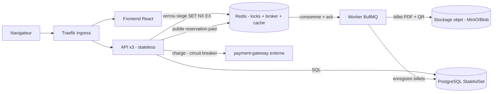

# TicketFlow

Plateforme de **billetterie avec réservation de sièges**, conçue pour démontrer une architecture
cloud-native sur un cas d'usage réel : verrou de siège concurrent, paiement résilient, génération
asynchrone des billets. Projet M2 (binôme).

## Architecture



Réserver un siège pose un **verrou Redis à expiration** (`SET NX EX`). Au checkout, l'API appelle la
**passerelle de paiement** derrière un **circuit breaker** ; en cas de succès elle publie
`reservation.paid`. Le **worker** génère alors le billet (QR + PDF) et le dépose dans le stockage objet,
de façon asynchrone et idempotente.

## Stack

| Couche | Choix |
|---|---|
| Frontend | React, React Router |
| API | Node.js / Express, JWT (stateless) |
| Worker | Node.js / BullMQ |
| Paiement | service `payment-gateway` (mock, faillible à la demande) |
| Base de données | PostgreSQL (StatefulSet + PVC) |
| Locks / broker / cache | Redis (`SET NX EX`, BullMQ) |
| Stockage objet | MinIO (local) / Azure Blob (cloud) |
| Orchestration | Kubernetes (minikube local, AKS cloud) |
| Ingress | Traefik (Helm) |
| IaC | Terraform (Azure) |
| CI/CD | GitHub Actions |

## Démarrage rapide (local)

```bash
cp .env.example .env
docker compose up --build
```

Services : api `:4000`, payment-gateway `:4200`, MinIO `:9000` (console `:9001`), Postgres `:5432`, Redis `:6379`.
L'API applique les migrations + seed un événement de démo au démarrage.

```bash
curl localhost:4000/healthz
```

### Démontrer le circuit breaker

Relancer la passerelle en mode « en panne » puis tenter un paiement :

```bash
PAYMENT_FAILURE_RATE=1 docker compose up -d payment-gateway
# après quelques tentatives, le circuit s'ouvre -> l'API répond 503 (degraded) sans planter
```

## Documentation

- `docs/architecture.md` — schéma + patterns
- `docs/api-contract.md` — contrat d'API (référence frontend)
- `docs/adr/` — décisions techniques
- `infra/` — Kubernetes, Helm, Terraform

## Roadmap (48h)

- [ ] Cœur métier : événements, hold de sièges, checkout + paiement, billets async
- [ ] Containerisation + `docker compose`
- [ ] Déploiement minikube (StatefulSet, Helm, Traefik, HPA, probes)
- [ ] Terraform -> AKS + CI/CD + URL publique
- [ ] Résilience, observabilité, README final, répétition démo
