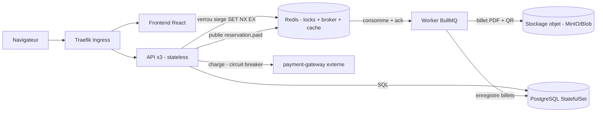

# Architecture — TicketFlow

## Patterns démontrés
- **API stateless** (JWT), scalable (3 replicas).
- **Microservices** : `api`, `worker`, `payment-gateway`.
- **Verrou de siège** : Redis `SET NX EX` (atomique, expiration auto) — gère la concurrence.
- **Message broker avec ack** : BullMQ ; retries + backoff + dead-letter.
- **Circuit breaker + timeout** : opossum autour de l'appel `api -> payment-gateway`, avec fallback dégradé.
- **Résilience** : arrêt gracieux `SIGTERM`, handler worker idempotent, probes.
- **K8s** : Deployment/ReplicaSet, StatefulSet (Postgres) + PVC, Service, ConfigMap/Secret, HPA, PDB, Ingress Traefik.

## Déploiement
- Local : `docker compose` (dev) ; `minikube` + `kubectl apply -f infra/k8s`.
- Cloud : Terraform (AKS, ACR, PostgreSQL, Key Vault, Blob) ; CI pousse les images sur l'ACR ; Helm déploie sur l'AKS ; Traefik expose l'URL publique.
