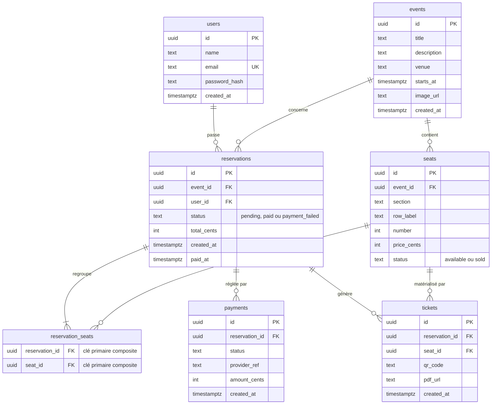

# Modèle de données — TicketFlow

Schéma relationnel (PostgreSQL) issu de `backend/api/migrations/001_init.sql`.
Le diagramme ci-dessous est rendu automatiquement par GitHub.

## Dictionnaire & règles

- **Identifiants** : toutes les clés primaires sont des `UUID` générés par `gen_random_uuid()` (extension `pgcrypto`).
- **Clés étrangères** : toutes en `ON DELETE CASCADE` (supprimer un événement supprime ses sièges, réservations, etc.).
- **`users.email`** : contrainte `UNIQUE`.
- **`seats`** : `UNIQUE (event_id, section, row_label, number)` — un siège est unique dans un événement. Statut en base : `available` ou `sold`.
- **`reservations.status`** : `pending` → `paid` (paiement réussi) ou `payment_failed` (circuit breaker / refus).
- **`reservation_seats`** : table d'association **N–N** entre `reservations` et `seats`, clé primaire composite `(reservation_id, seat_id)`.
- **`tickets`** : `UNIQUE (reservation_id, seat_id)` — garantit **l'idempotence** de la génération de billets par le worker (un seul billet par siège/réservation, même si l'événement est rejoué).
- **`payments`** : trace chaque règlement (référence du fournisseur, montant, statut).

## Point d'architecture à souligner à l'oral

Le statut transitoire **`held`** (siège en cours de réservation) **n'existe pas en base** : c'est un **verrou temporaire dans Redis** (`SET NX EX`, TTL configurable via `HOLD_TTL_SECONDS`). La base ne connaît que `available` / `sold` ; l'API fusionne l'état Redis au moment d'afficher le plan de salle. C'est ce qui démontre le **contrôle de concurrence par Redis** : deux clients ne peuvent pas verrouiller le même siège en même temps.
